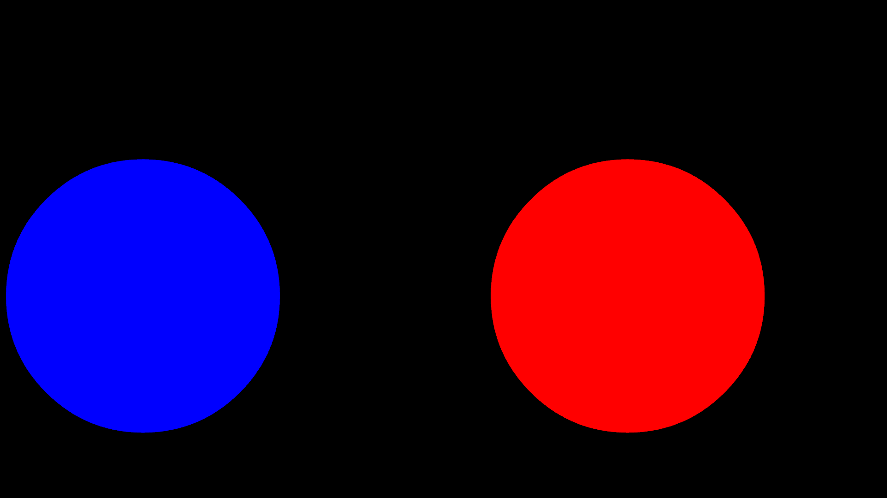

# basic-patterns1

A program made using the [nannou framework for creative coding in Rust](https://nannou.cc)

This sketch explores the idea of receiving and processing SuperCollider events via OSC. 
