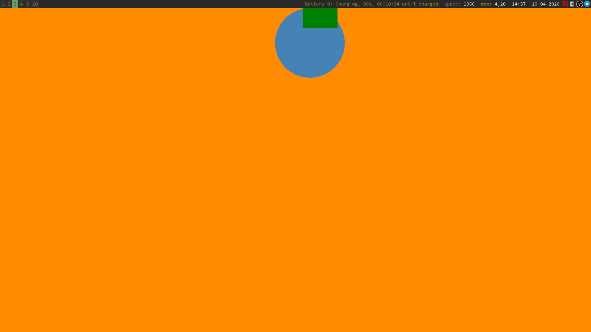

# sketch-190420-1

A program made using the [nannou framework for creative coding in Rust](https://nannou.cc)

This sketch has a circle moving about the screen. The screen has been divided into squares and when the circle is in one of these squares, the square in particular is painted.
